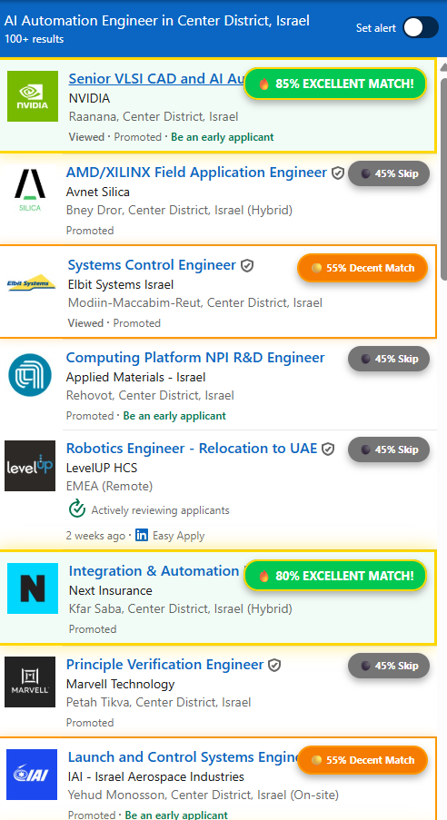
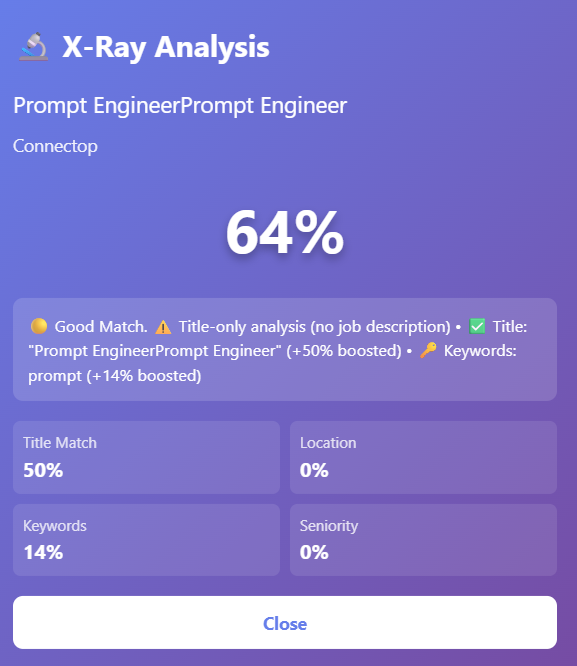
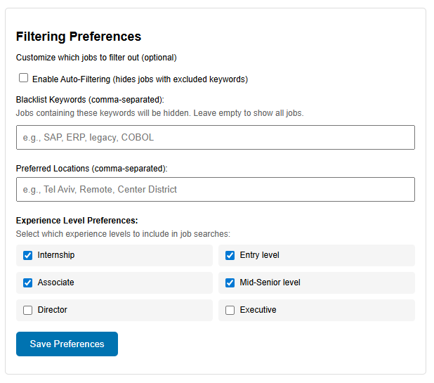

# JobHunter AI v2.1

AI-powered Chrome extension that analyzes LinkedIn jobs in real-time and shows match scores based on your professional profile.

## What it does

- **Scans LinkedIn jobs** as you browse - no manual work
- **Color-coded badges**: Green (75%+) = Apply | Orange (50-74%) = Maybe | Gray (<50%) = Skip
- **Extracts your Job DNA** from your CV - skills, tech stack, target titles
- **Smart LinkedIn search** using your primary job title
- **Export top matches** to CSV

## Quick Start

1. Clone: `git clone https://github.com/Dude775/jobhunter-ai.git`
2. Chrome -> `chrome://extensions/` -> Developer Mode ON -> Load Unpacked -> Select folder
3. Click extension -> Options -> Enter Claude API key
4. Paste your CV -> Click "Analyze CV"
5. Go to LinkedIn Jobs -> See the magic

## New in v2.1

- **Target Job Titles**: Auto-extracts 5 best-fit job titles from your CV
- **Experience Level Filter**: Choose Junior/Mid/Senior/Executive
- **Smarter Search**: Uses your PRIMARY job title, not random keywords
- **Improved Matching**: Better title-to-skills correlation

## How Scoring Works

| Color | Score | Meaning |
|-------|-------|---------|
| Green | 75%+ | Strong match - Send CV |
| Orange | 50-74% | Partial match - Review carefully |
| Gray | <50% | Low match - Skip |

## Features

- **Job DNA Analysis**: Skills, Tech Stack, Seniority, Target Titles
- **Real-time Scoring**: Instant badges on every job listing
- **X-Ray Mode**: Deep analysis on click (beta)
- **CSV Export**: Top 10 matches with scores and links
- **Privacy First**: All processing local, your API key

## Requirements

- Chrome browser
- Claude API key ([get one here](https://console.anthropic.com))

## Tech Stack

- Vanilla JavaScript
- Chrome Extension Manifest V3
- Claude API (Haiku)

## Changelog

### v2.1 (December 2024)
- Added: Target Job Titles extraction
- Added: Experience Level multi-select filter
- Improved: LinkedIn search query logic
- Improved: Title matching algorithm
- Fixed: Keyword synonym expansion

### v2.0 (December 2024)
- Initial public release
- Job DNA profile system
- Real-time badge scoring
- CSV export

## License

MIT - Free to use, modify, share.

---

Built by [David Rubin](https://linkedin.com/in/drubin877) | Israel

Star this repo if it helps your job search!
